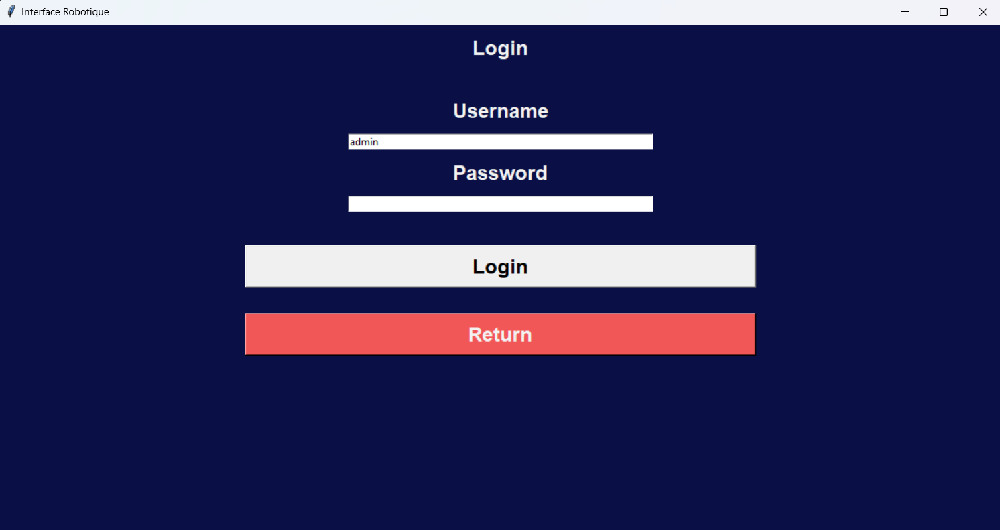

# Projet_IHR
Projet Interaction Humain/ Robot Mobile

# To install
    pip install tkinter
    python -m pip install ttkbootstrap
    pip install bcrypt
    
# Screenshots
Main window

Controll window

Login for configuration

Configuration

