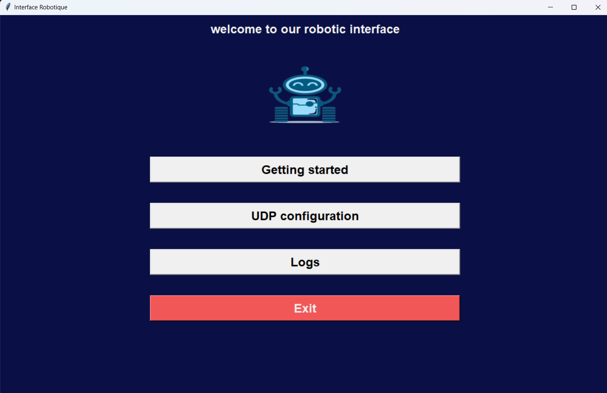
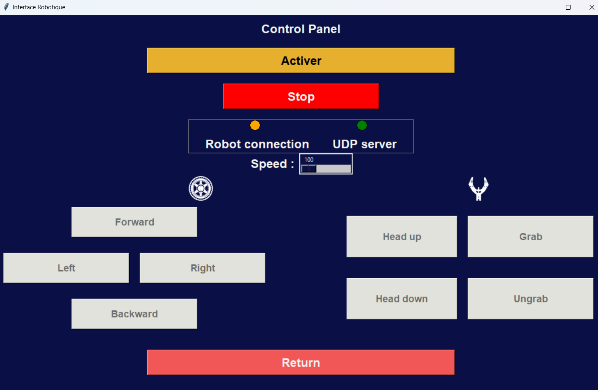

# Projet_IHR
Projet Interaction Humain/ Robot Mobile

# To install for the interface.py version 
    pip install tkinter
    python -m pip install ttkbootstrap
    pip install bcrypt
## To install for the interface_wl.py version
    pip install tkinter
# Screenshots
Main window

Controll window

Login for configuration

Configuration

